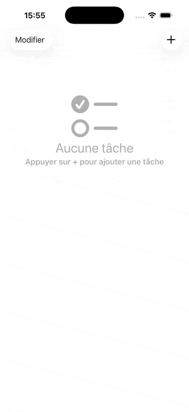

# 📝 ToDoList App

  

## 📖 Description

Application ToDoList développée en **SwiftUI**. Ce projet fait partie du cours [Swiftful Thinking](https://www.youtube.com/@SwiftfulThinking) et me permet d'explorer le développement iOS natif.

## ✨ Fonctionnalités

- ✅ **Ajouter des tâches** avec validation de saisie (minimum 4 caractères)
- 🔄 **Marquer comme complétée** en tapant sur une tâche
- 🗑️ **Supprimer des tâches** avec swipe-to-delete
- ↕️ **Réorganiser** les tâches par drag & drop en mode édition
- 💾 **Persistance des données** avec UserDefaults
- 🎨 **Interface moderne** en SwiftUI avec animations fluides
- 📱 **Écran vide personnalisé** quand aucune tâche n'existe

## 🛠️ Technologies & Concepts appliqués

### Architecture SwiftUI moderne
- **@Observable** pour le state management (iOS 17+)
- **@Environment** pour l'injection de dépendances
- **MVVM Pattern** avec séparation ViewModel/View
- **Navigation** avec NavigationStack et NavigationLink

### Fonctionnalités iOS
- **UserDefaults** pour la persistance locale
- **Codable** pour l'encodage/décodage JSON
- **List** avec édition, suppression et réorganisation natives
- **Alerts** pour la validation utilisateur
- **Toolbar** et **EditButton** pour l'interface

### Bonnes pratiques
- Gestion d'état réactive avec Observable
- Animations avec `withAnimation`
- Validation des inputs côté client
- Code modulaire et réutilisable

## 📚 Apprentissages clés

Ce projet m'a permis de maîtriser :
- La transition de `@StateObject/@ObservedObject` vers `@Observable` (approche moderne)
- La gestion de la persistance des données en iOS
- L'architecture MVVM dans un contexte SwiftUI
- Les patterns de navigation et toolbar natifs iOS
- L'utilisation de SF Symbols pour l'iconographie

## 🎯 Contexte personnel

Je consacre 4h/jour à l'apprentissage de SwiftUI via le cours "100 Days of SwiftUI" de Paul Hudson et "Swiftful Thinking". Mon objectif : devenir développeur iOS.

## 🔗 Ressources

- [Swiftful Thinking - YouTube](https://www.youtube.com/@SwiftfulThinking)
- [Apple SwiftUI Documentation](https://developer.apple.com/documentation/swiftui/)

## 📝 License

Ce projet est un exercice éducatif basé sur le tutoriel Swiftful Thinking.

## 🤝 Contact

Guillaume Richard - Développeur Full-Stack en formation
---

*Projet réalisé dans le cadre de ma formation autodidacte en développement iOS - Février 2026*
